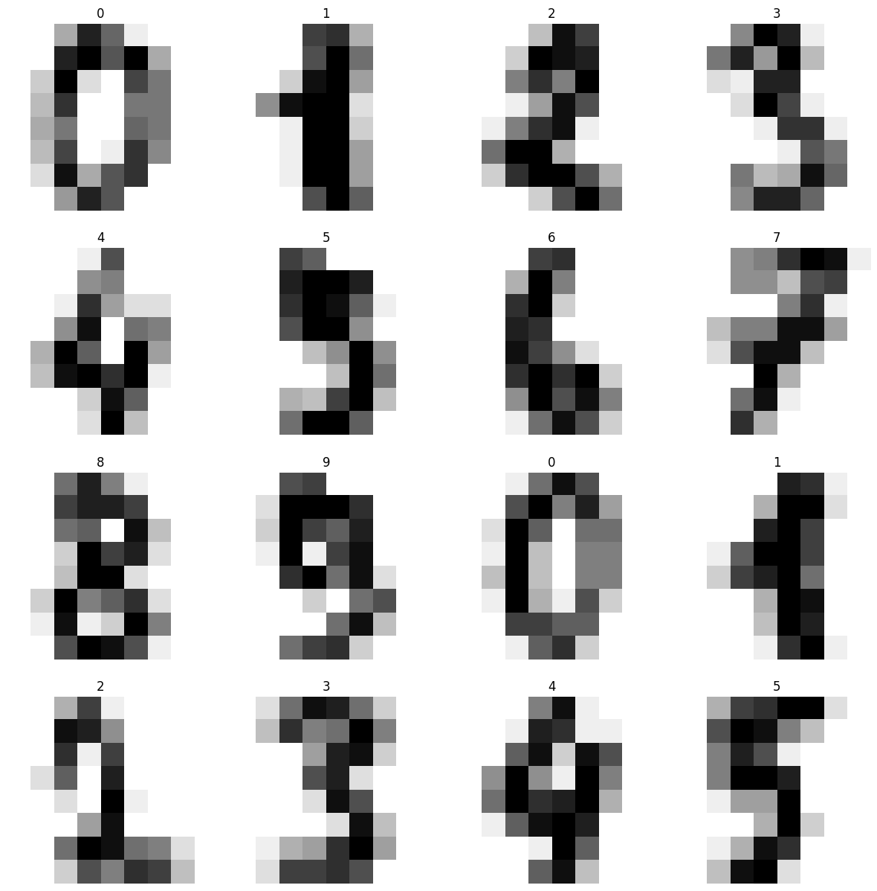
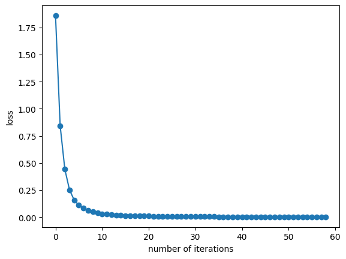

# Handwritten-Digits-Recognizer
A repository to recognize handwritten digits' images in low resolution.

Digits dataset consists of low-resolution images of handwritten digits, which may be difficult for the human eye to read, to implement in a neural network.

The following subplot shows the loss_curve_ of the MLPCalssifier used, reaching an accuracy score of 0.944792973651192.

